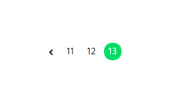
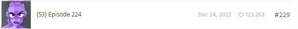
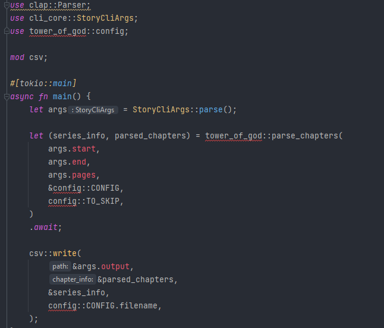
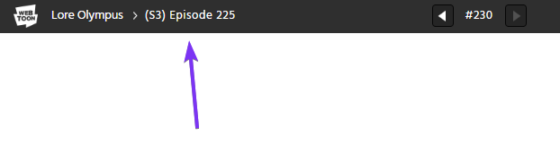
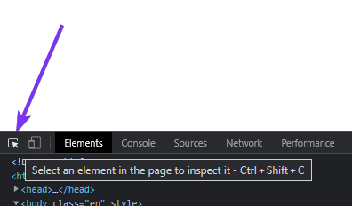
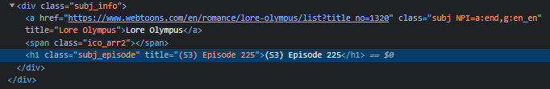
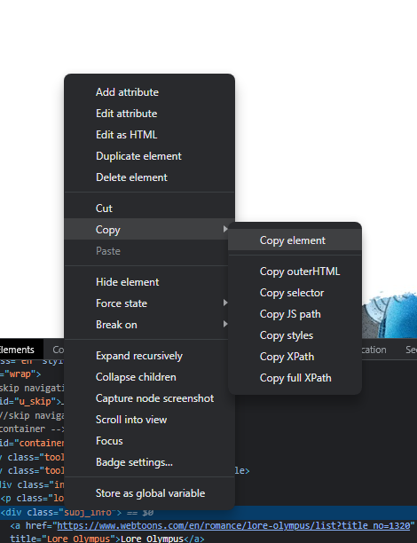

<h1 style="text-align: center;">ScrapeToon</h1>

<p align="center">
  
</p>

<p align="center">
  A tool for scraping information from <a href="https://www.webtoons.com">Webtoons</a>
</p>

<br/>

There is a generic tool, `scrapetoon`, that gets Daily Schedule information as well as Story Page information. In addition to this are story specialized projects that get the same info as the Story Page, but also things like comments.

## What's Scraped

### Daily Schedule

The data gathered from here is organized like so:

| title | author | genre | total_likes | status | scrape_date |
|:-----:|:------:|:-----:|:-----------:|:------:|:-----------:|

The likes information, once it gets to the millions, is truncated, i.e. 1.1M. This data is nice for a broad, cast with a net, but if you want more accuracy than you would need to use the other part of the scraper and scrape the stories page.

### Story Page

The data gathered from here is organized like so:

| title | author | genre | total_likes | status | release_day | views | subscribers | rating | chapter | likes | date | scrape_date |
|:-----:|:------:|:-----:|:-----------:|:------:|:-----------:|-------|-------------|--------|---------|-------|------|-------------|

The `chapter`, `likes`, and `date` are all relative to one chapter, with a new chapter on each row. The date is in the ISO 8601 format.

## ScrapeToon Usage

Binary executables are provided for Windows, Mac, and Linux [here](https://github.com/RoloEdits/webtoon-scraper/releases).

The executable is stand alone and fully portable. Simply placing it in a folder is all that is needed to continue forward.

Once placed in a folder, simply right click in an empty part of the file explorer window and open the folder in a terminal.

From there you just need to enter `.\scrapetoon.exe` on Windows, or `./scrapetoon` on Linux and Mac.

Once there you then have the option of which source of data you want to scrape: `daily` or `story`.

For example:

```shell
.\scrapetoon.exe daily
```

```shell
.\scrapetoon.exe story
```

`daily` requires only an output location to be given. This is done with either `--output` or the short version `-o` followed by the output directory.

For example:

```shell
.\scrapetoon.exe daily -o "D:\Desktop"
```

```shell
.\scrapetoon.exe daily --output "D:\Desktop"
```

`story` requires a bit more. Firstly a URL needs to be given after, with the flags `-u | --url`.

```shell
.\scrapetoon.exe story --url "https://www.webtoons.com/en/action/omniscient-reader/list?title_no=2154"
```

And secondly, it also requires a numerical value to be given for an `end`. This value correlates to the page numbers below the chapter list. The scraper goes from 1 to the entered value. If you want all pages to be gone through, then you just enter the highest, the last, page.



In this case, if I want all pages, I enter 13

```shell
.\scrapetoon.exe story -u "https://www.webtoons.com/en/action/omniscient-reader/list?title_no=2154" -e 13
```

```shell
.\scrapetoon.exe story -url "https://www.webtoons.com/en/action/omniscient-reader/list?title_no=2154" --end-page 13
```

And same as before the `-o | --output` flag.

```shell
.\scrapetoon.exe story -u "https://www.webtoons.com/en/action/omniscient-reader/list?title_no=2154" -e 13 -o "D:\Desktop"
```

```shell
.\scrapetoon.exe story -url "https://www.webtoons.com/en/action/omniscient-reader/list?title_no=2154" --end-page 13 --output "D:\Desktop"
```

Once you have what you need entered in, press the `ENTER` key, and it will begin its operation. If you entered an invalid output path, it will stop and inform you. From the entered path, a folder in created with the name of the current UTC date as its name. After that you will be prompted with a message of an attempt to connect, and once connected, a progress bar will render showing the elapsed time as well as the current amount done and what's needed.

The output files will either be `daily_schedule.csv` if you configured for `daily`, or `<STORY NAME>.csv` if you configured for `story`. In this examples case: `omniscient reader.csv`.

An alternative to using the program in a folder is to add it to your main `PATH`. Doing this would allow you to use the program no matter directory and with just the name `scrapetoon` rather than `.\scrapetoon.exe`. 

# Series Specific Scraping

As only so much data can be gotten so that it can work for all the stories on Webtoon, there is a lot that can be lost. And in an effort to keep the more generic project as simple to use as possible, some extra capabilities are also missing.

That's where story specific projects come in. These projects are there to get extra data otherwise not provided by the more generic scraping already provided. Like season number, season chapter, as well as comment data, such as amount a chapter has as well as the actual comments themselves. Being able to tailor what you get that's unique to a story could allow for a more fined grained experience.

In light of the more focused, and slightly more technical requirements, comes with it a runtime dependency. [ChromeDriver](https://chromedriver.chromium.org/downloads). To know which one to download you can just open up chrome and check the version you have. Download the matching major release version. 107, 108, 109, etc.

Additionally, beyond this point, I assume that you have already set up your rust development environment and are familiar with the basics of using VS Code. 

## Using

Binaries for these projects won't be provided, as it's too highly possible that the logic would need to be updated to accommodate new changes that break functionality. To use them you must clone the repo and build from source.

Run the `chromedriver` that you downloaded and installed.

`cd` into the project folder. The usage will look like this:

```shell
cargo run --release -- --start <START> --end <END> --pages <PAGES> --output <OUTPUT>
```

`--start`: Is the lowest number of the `#<NUM>` you wish to scrape.

`--end`: is the largest number of the `#<NUM>` you wish to scrape.

`--pages`: Is the largest chapter list page number that covers the start and end range given.

`--output`: Is the location the program will save the file.

Example:

```shell
 cargo run --release -- --start 1 --end 230 --pages 23 --output "D:\temp\"
```

Time estimation:

Chapter amount * 5 / 60 = Minutes Needed. There is some preamble that needs to process, but the bulk of most stories will be taken up on in the chapter by chapter process.

## Adapting Your Own Series Project

As part of the documentation, I will be showing a full conversion process from the base project to the final new story project.

The base project is `tower-of-god`. It has with it extra comments that go into some extra explanations where needed.

I will be adapting the new project to fit [Lore Olympus](https://www.webtoons.com/en/romance/lore-olympus/list?title_no=1320).

## What's Included

No matter the story, there are things that can be shared between them no matter the case. This idea of working no matter the case needs purely means that it will run and not crash, whether the info can be used in the correct way or is representative of good data is undetermined.

As such, all data that is gotten as part of the [Story Page](#story-page) are included by default, along with the additions of:

| chapter_length | comments | total_comments | user | comment_body | post_date | upvotes | downvotes | reply_count |
|----------------|:--------:|:--------------:|:----:|:------------:|:---------:|:-------:|:---------:|:-----------:|

The way the scraping is implemented will work for all stories, but later on in this example, you will see that this data isn't always functionally usable.

## Surveying Story

Firstly, we need to do some recon. Ideally, you know enough about the story already to know what else you can get from it as data. 

Going to the stories page a few things stand out immediately. 



Thinking of what is not gotten already, or in a wrong way, I can see that there are seasons, and that there is potential of a pattern here with `(S3)`. Scrolling beyond to other pages I can see that this holds true for season 2, with `(S2)`, however going back before that, to season 1, there is no such `(S1)` or any indicator of a season. We will need to keep this in mind.

Going further, I can see that there are some content that is not part of the actual continuity. Like a `Q&A` for `#18` and `Message and Concept Art` for `#13`. The choice of what to do in these misc. chapters, like spin-offs, is up to you. For this example, I will simply be bypassing them, focusing just on the main chapters of the story.

These misc. chapters lead into another issue we need to be aware of. A good rule of thumb is to load up the latest chapter and looking at both the shown chapter number and the URL number and seeing if they align. If they don't, it speaks to a sign that there will be a bad page that needs to be taken care of and offset.

```
https://www.webtoons.com/en/romance/lore-olympus/s3-episode-225/viewer?title_no=1320&episode_no=230
```

The part we need to pay attention to is the very end, the `episode_no=` part.


In this example of Episode `#230`, they do, in fact, match up, meaning that more likely than not we won't have to deal with the sites technical issue workarounds. If the story you are adapting doesn't match up, this means that they, for some reason, had to skip a number. You just need to find where this happened and note the bad `episode_no=` number for later.

Back to the chapter list page, another thing that becomes apparent is that although there are seasons, there is no separate indicator of the chapter number relative to the season. It's working off of the absolute chapter counter. But this leads to another issue, the implementation that gets the chapter number data uses the `#230` value. The added misc. chapters offset this to be off by 5 from the real(meaningful) chapter number. This will be something that we will have to manage to get out meaningful data, in this case being a continuous counter of the main story.

As far as story specific data, really it's just the season number that we want to add and that a chapter would be associated with a season. So with the surveying done, lets get to adapting.

## Copying Project Folder and Adapting It

### Cargo Workspace

First step here is to copy the `tower-of-god` project folder and then rename it to the story you want. In this examples case `lore-olympus`.

In the newly renamed folder, open its `Cargo.toml` file and under the `[package]` section, edit the `name = ` to match the new folder name.

From this:

```toml
[package]
name = "tower-of-god"
```

To this:

```toml
[package]
name = "lore-olympus"
```

After that, open up the `Cargo.toml` file in the main directory, not the stories folder but in the base of the whole repo, and add the same folder name to the list.

An example of what you could see:

```toml
[workspace]

members = ["project_core", "line_core", "cli_core", "scrapetoon", "tower-of-god", "true-beauty", "the-god-of-high-school"]
```

Adding the name:

```toml
[workspace]

members = ["project_core", "line_core", "cli_core", "scrapetoon", "tower-of-god", "true-beauty", "the-god-of-high-school", "lore-olympus"]
```

### main.rs Changes

Once this is done, open up the `main.rs` file inside the `src` folder.

It should look something like this, with red squiggles indicating errors. 



The fix is to change `tower_of_god` to the new name we have been using. A format like this: `use <project name>::config;` and `<project name>::parse_chapters`.

In our case we change to `lore_olympus` like so:

```rust
use clap::Parser;
use cli_core::StoryCliArgs;
use lore_olympus::config;

mod csv;

#[tokio::main]
async fn main() {
    let args = StoryCliArgs::parse();

    let (series_info, parsed_chapters) = lore_olympus::parse_chapters(
        args.start,
        args.end,
        args.pages,
        &config::CONFIG,
        config::TO_SKIP,
    ).await;

    csv::write(
        &args.output,
        &parsed_chapters,
        &series_info,
        config::CONFIG.filename,
    );
}
```

This should fix those and set us up for the rest of the work we need to do.

### config.rs

Next up is to open the `config.rs` file. As much as could be put in one spot for ease of access was put here. 

You will notice some comments here, but explanations will be done in this guide. 

With all the comments stripped away, this is what we have.

```rust
pub struct ChapterInfo {

    pub season: u8,
    pub season_chapter: u16,

    pub chapter_number: u16,
    pub comments: u32,
    pub likes: u32,
    pub date: String,
    pub user_comments: LinkedList<UserComment>,
    pub chapter_length: u32,
}

pub trait CommentSum {
    fn sum_total_comments(&self) -> u32;
}

impl CommentSum for LinkedList<ChapterInfo> {
    fn sum_total_comments(&self) -> u32 {
        let mut accumulator = 0;
        for chapter in self {
            accumulator += chapter.comments;
        }

        accumulator
    }
}

pub const CONFIG: SeriesConfiguration = SeriesConfiguration {

    filename: "tower-of-god",

    page_url: "https://www.webtoons.com/en/fantasy/tower-of-god/list?title_no=95",

    episode_url: "https://www.webtoons.com/en/fantasy/tower-of-god/season-3-ep-133/viewer?title_no=95&episode_no=",

    episode_url_offset: 1,
};

type Skip = fn(u16) -> bool;

pub const TO_SKIP: Skip = |chapter: u16| -> bool {
    match chapter {
        221 => true,
        _ => false,
    }
};
```

Let's go through each part and explain in detail.

#### ChapterInfo Struct

```rust
// Unchanged - Tower of God
pub struct ChapterInfo {

    pub season: u8,
    pub season_chapter: u16,

    pub chapter_number: u16,
    pub comments: u32,
    pub likes: u32,
    pub date: String,
    pub user_comments: LinkedList<UserComment>,
    pub chapter_length: u32,
}
```

This struct is the data that will be scraped in addition to the other data mentioned before.

I've put new lines in to block out an important thing. The `chapter_number`, `comments`, `likes`, `date`, and `user_comments` is something that will work in all story cases; you won't need to worry about messing with them.

On the other hand `season` and `season_chapter` is something that is specific to 'Tower of God'. This area is meant to be were we add our story specific data.

For 'Lore Olympus', we have already determined that is has a season number and that we need to specially handle the chapter number. This is where we put that data, in preparation for that. 

`season` can remain as that is also something we want from `Lore Olympus`, and we can change `season_chapter` to something that clearly defines what the meaningful chapter number would be.

```rust
// Lore Olympus
pub struct ChapterInfo {

    pub season: u8,
    pub meaningful_chapter_number: u16,

    pub chapter_number: u16,
    pub comments: u32,
    pub likes: u32,
    pub date: String,
    pub user_comments: LinkedList<UserComment>,
    pub chapter_length: u32,
}
```

Note how we are still leaving the `chapter_number` alone. This is very important that we leave it be. This value is used elsewhere in the program to match meaningful data together. The fix for the final data will take place in the end.

##### SeriesConfiguration

```rust
// Unchanged - Tower of God
pub const CONFIG: SeriesConfiguration = SeriesConfiguration {

    filename: "tower-of-god",

    page_url: "https://www.webtoons.com/en/fantasy/tower-of-god/list?title_no=95",

    episode_url: "https://www.webtoons.com/en/fantasy/tower-of-god/season-3-ep-133/viewer?title_no=95&episode_no=",

    episode_url_offset: 1,
};
```

`filename`: what the filename will be called. As part of a convention I am making, this will be the story's name in its lowercase and hyphenated form. e.g. final output `lore-olympus.csv`.

`page_url`: The URL of the story page. To note here, if you have changed pages but then go back to the first page to copy the url, be aware that there is an added `&page=<PAGE>` at the end. What we want to end on is `title_no=<ID>`, where ID is whatever Webtoon have given as an ID to the story.

`episode_url`: The URL format when you are on a chapters/episode page. You can open any episode to get the url. The key here is that after pasting it in, you remove the numbers at the end of `&episode_no=<NUM>`. What you want the end to be is `&episode_no=`.

`episode_url_offset`: When looking to see if the latest episode matches up with the number in its URL, in the case we checked out `#230` and found that it did match, this is where the difference is offset. For example, if `#230` instead had a URL that ended in `231`, then we put a `1` for this value. In our case they were the same, so we just put a `0`.

Here is the adapted version: 

```rust
// Lore Olympus
pub const CONFIG: SeriesConfiguration = SeriesConfiguration {

    filename: "lore-olympus",

    page_url: "https://www.webtoons.com/en/romance/lore-olympus/list?title_no=1320",

    episode_url: "https://www.webtoons.com/en/romance/lore-olympus/episode-1/viewer?title_no=1320&episode_no=",

    episode_url_offset: 0,
};
```

##### Skipping and Bad Page Loads

To make a quick note at the start about this, the numbers given here are the URLs `&episode_no=<NUM>` number, not the `#<NUM>` number.

And to connect to the previous section, if your `episode_url_offset` was not 0, then you will have to go through the chapters and find when the URL jumped ahead. As a rule of thumb, for every amount offset, there will be an equal number of values you have to give. This is a very important thing to get right as these numbers, when used in the URL, give back a page that will crash the program.

In Tower of God the number `221` leads to a bad page, and thus needs to be skipped.

```rust
// Unchanged - Tower of God
pub const TO_SKIP: Skip = |chapter: u16| -> bool {
        matches!(chapter, 221)
};
```

In our case, we have no need to skip due to bad page loads, but we do have some misc. chapters we want to skip. We can see that we have 5 things to skip as that is the difference between the `Episode <NUM>` and the `#<NUM>`.

To be exact:
`#13`: `Message and Concept Art`
`#18`: `Q&A`
`#31`: `Hiatus special short`
`#47`: `QnA`
`#120`: `Season 1 Recap`

And since the `#<NUM>` matches up with the URL number, we can just use those same numbers here. It's important to note that this won't always be the case. 

```rust
// Lore Olympus
pub const TO_SKIP: Skip = |chapter: u16| -> bool {
        matches!(chapter, 13 | 18 | 31 | 47 | 120)
};
```

If you have nothing to skip, you can simply just return `false`

```rust
// No Skips
pub const TO_SKIP: Skip = |chapter: u16| -> bool {
    false
};
```

### lib.rs

We need to change the data to match what we changed to in the `ChapterInfo` struct.

In this section you might already be getting indicators about what we need to change. It tells us that there is no field named `season_chapter` on `ChapterInfo`. In our case we just need to change that to be our added `meaningful_chapter_number`.

```rust
result.push_back({
            ChapterInfo {
                season,
                meaningful_chapter_number,

                chapter_number,
                comments,
                likes,
                date,
                user_comments,
                chapter_length,
            })
```

Now we get a new error though. There is no `meaningful_chapter_number` in scope. Just to get it in a compiling state, we need to change a few things. First we need to change the now unused variable of `season_chapter` to `meaningful_chapter_number` and then also change part of the function name from `parse_season_chapter_number` to `parse_meaningful_chapter_number`

From this:

```rust
let season_chapter = story_specific_parsing::parse_season_chapter_number(&html);
```

To this:

```rust
let meaningful_chapter_number = story_specific_parsing::parse_meaningful_chapter_number(&html);
```

And now another error. But this one leads us to the next file.

### story_specific_parsing.rs

To solve the error, we just need to rename the function `parse_season_chapter_number` to `parse_meaningful_chapter_number`, same as before. The logic inside won't work, but that's all we need to do now to get it to compile. To note here, you should use to rename ability of your text editor to change all instances of the functions name.

#### Season

Given that 'Tower of God' also has a season number, we can simply adapt its implementation.

```rust
pub fn parse_season_number(html: &Html) -> u8 {

    let title_selector = Selector::parse("h1.subj_episode").unwrap();

    let regex = regex![r"Season\s(\d)"];

    let title = html
        .select(&title_selector)
        .into_iter()
        .next()
        .unwrap()
        .text()
        .collect::<Vec<_>>()[0];

    let season = regex
        .captures(title)
        .unwrap()
        .get(1)
        .unwrap()
        .as_str()
        .parse::<u8>()
        .unwrap();

    season
}
```

`h1.subj_episode` corresponds to this section: The `(S3) Episode 225` in this case.



This is great, as it's the area that has the info we need. Not just for the season, but also the correct, meaningful, chapter number we saw would be a problem earlier, but that will be next.

##### Setup Testing

First things first, to make the rest easy, we will go to a chapter, and once it's loaded, open up the dev tools of our browser. In Chrome, you can right-click and inspect. Then we need to get enter the selector tool and then click the `(S3) Episode <NUM>` part from above.



It should highlight an area in the elements tab:



Right-click on the `div class="subj_info">` element, and copy it.



Now near the bottom of the `story_specific_parsing.rs` file, you will see a test:

```rust
    #[test]
    fn should_parse_season_number() {
        const SEASON_NUMBER: &str = r#""#;

        let html = Html::parse_document(SEASON_NUMBER);

        let season_number = parse_season_number(&html);

        assert_eq!(season_number, 3);
    }
```

you want to paste what you just copied in-between `r#"<PASTE_HERE>"#`.

You have something like this:

```rust
const SEASON_NUMBER: &str = r#"<div class="subj_info">
                        <a href="https://www.webtoons.com/en/romance/lore-olympus/list?title_no=1320" class="subj NPI=a:end,g:en_en" title="Lore Olympus">Lore Olympus</a>
                        <span class="ico_arr2"></span>
                        <h1 class="subj_episode" title="(S3) Episode 225">(S3) Episode 225</h1>
                    </div>"#;
```

Now we can quickly test that what we are doing works.

##### Logic

To get our season number, we first need to have the regex match our pattern of `(<SEASON>)`.

```rust
    let regex = regex![r"\(S(\d)\)"];
```

If you don't know regex, and even if you do, this can be super confusing. But basically we have a pattern that matched `(S<DIGIT>)` and we are capturing the digits value.

Doing a test shows that it passes. But we have a problem here, as we saw earlier, there is no `(S1)` for those chapters. If you copied an element that was from Season 1, and tested, it will have failed.

For those who didn't use a chapter from Season 1, go now and copy an element the same as before and in the test function, copy the `SEASON_NUMBER`, `html`, `season_number`, and `result`. It will be simple enough to just add a 2 at the end of the variable name.

```rust
    #[test]
    fn should_parse_season_number() {
        const SEASON_NUMBER: &str = r#"<div class="subj_info">
                        <a href="https://www.webtoons.com/en/romance/lore-olympus/list?title_no=1320" class="subj NPI=a:end,g:en_en" title="Lore Olympus">Lore Olympus</a>
                        <span class="ico_arr2"></span>
                        <h1 class="subj_episode" title="(S3) Episode 225">(S3) Episode 225</h1>
                    </div>"#;

        const SEASON_NUMBER2: &str = r#"<div class="subj_info">
                        <a href="https://www.webtoons.com/en/romance/lore-olympus/list?title_no=1320" class="subj NPI=a:end,g:en_en" title="Lore Olympus">Lore Olympus</a>
                        <span class="ico_arr2"></span>
                        <h1 class="subj_episode" title="Episode 1">Episode 1</h1>
                    </div>"#;

        let html = Html::parse_document(SEASON_NUMBER);
        let html2 = Html::parse_document(SEASON_NUMBER2);

        let season_number = parse_season_number(&html);
        let season_number2 = parse_season_number(&html2);

        assert_eq!(season_number, 3);
        assert_eq!(season_number2, 1);
    }
```

Running the test again will fail as there is no `(S1)`.

```rust
let season = regex
        .captures(title)

        .unwrap()

        .get(1)
        .unwrap()
        .as_str()
        .parse::<u8>()
        .unwrap();
```

The problem is the first unwrap(). In our case it's a pretty simple solution; we just need to return `1` if there is an error.

I will note that because we have skipped any other content that would not have a `(S<DIGIT>)`, all that other misc. content, we are left with a situation where all that would be an issue are the real Season 1 Episodes. We can just default to returning `1` because of that. This won't always be the case. If you have a complex task and need help, open an issue and I will try my best to help.

Here is our simple solution.

```rust
let season = match regex
        .captures(title) {
            Some(cap) => cap,
            None => return 1
        }
        .get(1)
        .unwrap()
        .as_str()
        .parse::<u8>()
        .unwrap();
```

Now the test passes, and with that we have completed the season number logic.

#### Meaningful Chapter Number

Explanation of the problem: In the most generic of cases, the chapter number gotten from parsing the `#<NUM>` gives us what we want. This covers most kinds of scenarios, and because of the details of how data is gotten, is still needed to be scraped to be linked with that data. However, in our case, it doesn't give the best representation of the actual chapter count progression and, thinking of end use, leaves gaps between where it skipped.

To fix this we need to come up with a way that will either give us the data we need on from scraping the chapter, or manually offset the numbers on multiple points, where each point demarcating an instance we need to offset simply being subtracted by n-points amount. This kind of brute force method might be all that you have, in which case you just have to set up the logic yourself.

In our case, as mentioned before, the chapter number we want is in the same group of data as the Season number was. All we need to do is adjust the regex to capture that value.

As a reminder, the format is `(S<NUM>) Episode <NUM>`. As a benefit of skipping the extra misc. episodes that aren't related to the direct story continuity, all the chapters that will be parsed will have this pattern in the name. The Season 1 episodes just having `Episode <NUM>` as its pattern.

The current functions logic happens to line up close enough, just like the previous case, so only some small modifications are needed.

I won't be showing the test setup, as it's just a rehash of the prior showcase, but I would highly encourage setting them up to speed things up a lot.

First, lets change the variable name to match the new expected data. `season_chapter` -> `meaningful_chapter_number`.

After that is the regex. This also only needs a small modification.

```rust
let regex = regex![r"Episode\s(\d+)"];
```

Explained simply, this is looking for a pattern of `Episode<WHITESPACE><ONE_OR_MORE_DIGITS>`

And that's really all we need to do here.

### csv.rs

First up in this file is the rest of the cleanup from the project change. Just like before just change the name to the new project name.

From this: 

```rust
use tower_of_god::config::{ChapterInfo, CommentSum};
```

To this:

```rust
use lore_olympus::config::{ChapterInfo, CommentSum};
```

After that, we need to define what the output record will look like.

```rust
writer.write_record([
            "title",
            "author",
            "genre",
            "status",
            "release_day",
            "views",
            "subscribers",
            "rating",
            "chapter",
            "chapter_length",
            "comments",
            "total_comments",
            "likes",
            "total_likes",
            "date",
            "user",
            "comment_body",
            "post_date",
            "upvotes",
            "downvotes",
            "reply_count",
            "scrape_date",

            "season",
            "season_chapter",
        ])
```

From this list, we can leave most things alone. The main thing being that there is no `season_chapter`. We can choose to just replace this with the `meaningful_chapter_number`, leaving the `chapter` column alone, but as that field is what the `meaningful_chapter_number` is supposed to represent, we will just remove the `season_chapter` part. We will leave `chapter` alone here, solving the problem a little below.

Going down below this part, we need to change the variable name to match the new expectation, as well as reference the new field.

From this:

```rust
let season_chapter = chapter.season_chapter.to_string();
```

To this:

```rust
let meaningful_chapter_number = chapter.meaningful_chapter_number.to_string();
```

Finally, we the alignment of the data to what we wrote in our record up above.

```rust
writer
      .write_record([
            &title,
            &author,
            &genre,
            &status,
            &release_day,
            &views,
            &subscribers,
            &rating,
            &chapter_number,
            &chapter_length,
            &comments,
            &total_comments,
            &likes,
            &total_likes,
            &date,
            &user,
            &comment_body,
            &post_date,
            &upvotes,
            &downvotes,
            &reply_count,
            &current_utc_date,
            &season,
            &season_chapter,
            ])
```

We can remove the `season_chapter` altogether. And where `&chapter_number` is, we can put our new data `&meaningful_chapter_number`.

```rust
writer
      .write_record([
            &title,
            &author,
            &genre,
            &status,
            &release_day,
            &views,
            &subscribers,
            &rating,
            &meaningful_chapter_number,
            &chapter_length,
            &comments,
            &total_comments,
            &likes,
            &total_likes,
            &date,
            &user,
            &comment_body,
            &post_date,
            &upvotes,
            &downvotes,
            &reply_count,
            &current_utc_date,
            &season,
            ])
```

To remove the unused code warning, we can simply comment out the unused `chapter_number`

```rust
// let chapter_number = chapter.chapter_number.to_string();
```
### README.md

All that's left is to edit the `README.md` to match the name of the story and the data format. 

## Conclusion

And with that, we are done. Having had hindsight when writing this up, all of what we did is confirmed to work. But in your case, you should test and run the app to make sure it works as expected.

# Contribution

If you want to contribute, first of all, thank you, communities can only grow with effort. Small projects like these, for niches like Webtoons, really goes a long way in adding some depth and quality.

Contributing are pretty simple. For all instances, open a branch with a name that signifies the hopeful contribution, and then make whatever change you wanted, then begin the pull request process.

## Rust

For changes to rust based files, open up an issue first. That way if you have any questions that crop up, the issue can be used to talk through things. Upon pull request, reference the issue. 

Must fix most warning that pop up with:

```shell
cargo clippy -- -W clippy::pedantic
```

Any existing warnings are fine to leave, but any that are made from a change should be fixed, and if not, you must state a reason why in the pull request.

As for tests, if you are adding a new project with custom parsing, tests must be provided with the story examples used in the tests.

In general if you can provide test, please do. Helps to keep things sane.

## CSV

Csv submissions are also very much welcome. if you are adding a new project, putting in the csv you get out after use would be a great addition to the repo.

## Documentation

For markdown files, just simply passing a spell check should be good enough.

For rust documentation, similar applies.

# License

All CSV's hosted here are under a Creative Commons Zero v1.0 Universal License.

All software is under an MIT License.
