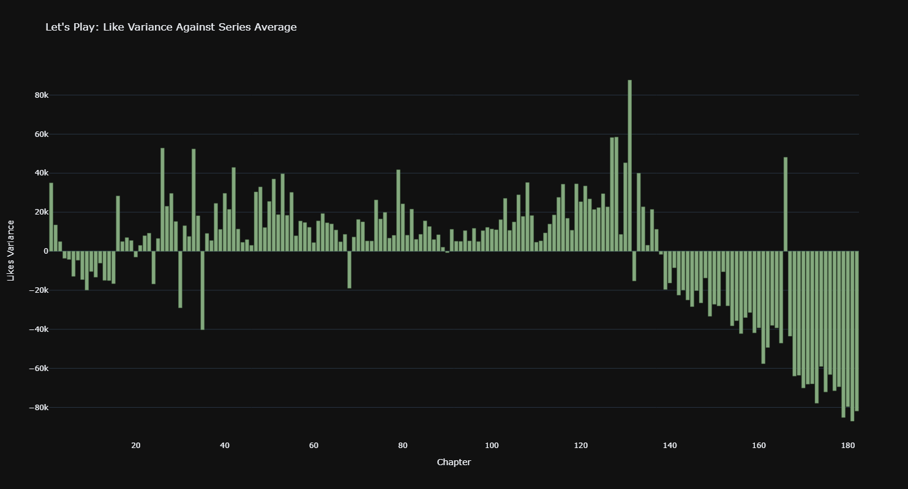
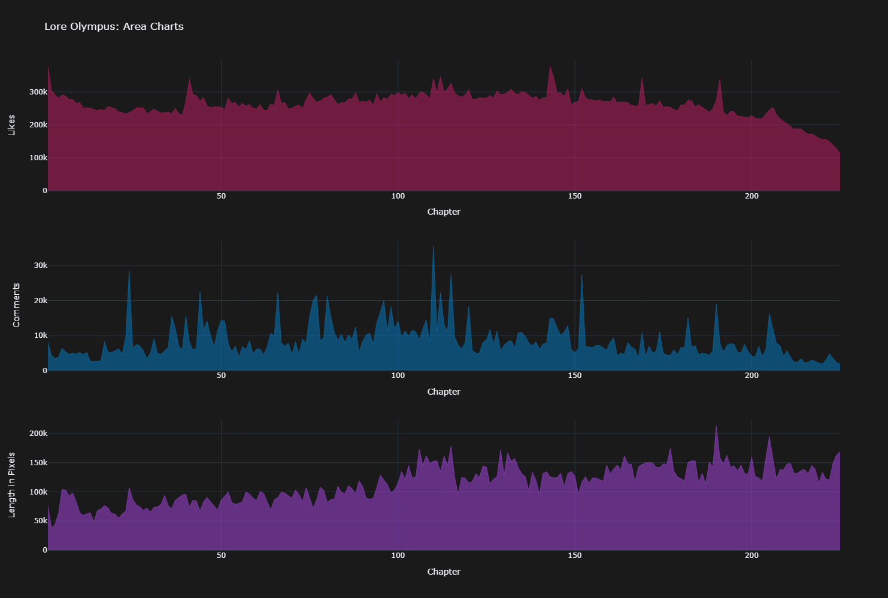
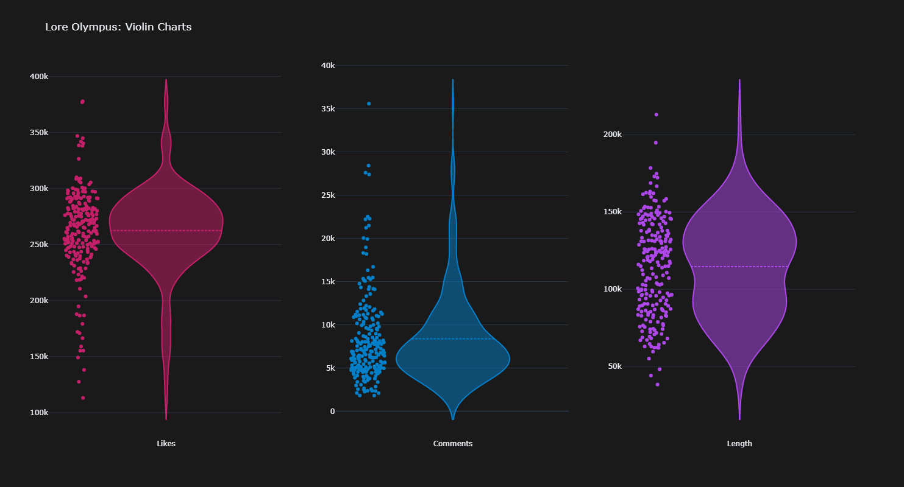
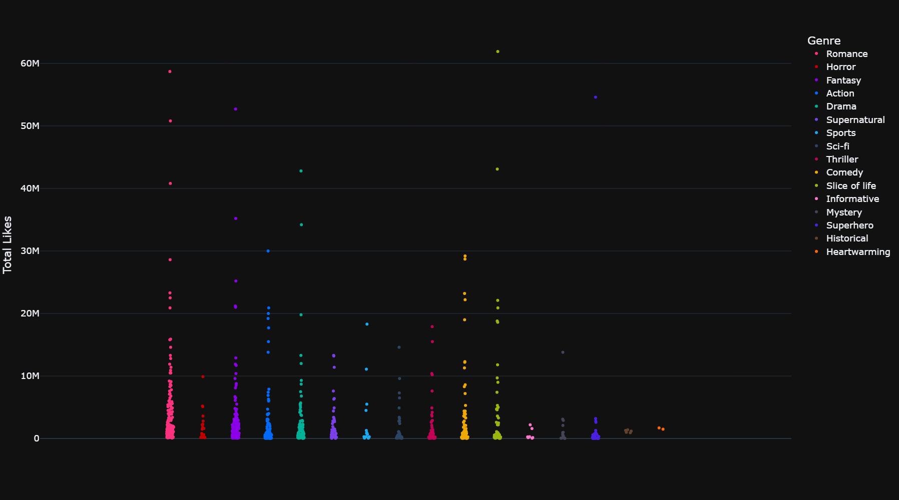

<h1 style="text-align: center;">Scrapetoon</h1>

<p align="center">
  
</p>

<p align="center">
  A tool for scraping information from <a href="https://www.webtoons.com">Webtoons</a>
</p>

<br/>

`scrapetoon` is a command-line tool that offers a way to get a Webtoon's stats as well as the ability to download its episodes. Binaries are provided [here](https://github.com/RoloEdits/scrapetoon/releases).

Remember to always verify the data gathered before using!

## Usage

`scrapetoon` as two subcommands: `stats` and `download`:

```shell
scrapetoon stats
```

```shell
scrapetoon download
```

Both require filling in `--url | -u`, `--output | -o`, and an `--episodes | -e`.

- `--url | -u` takes an input like: `https://www.webtoons.com/en/fantasy/tower-of-god/list?title_no=95`.
- `--output | -o` is given a path of which to save:
  - `stats` needs a filename: `tower-of-god.csv`
  - `download` needs a directory of which to save all the images of the episodes: `Tower of God/`
- `--episodes | -e` can take either a single integer (e.g., `150`) or as a range (e.g., `1..100`). Ranges can also be open ended:
  - `..200` (up to and including episode 200)
  - `350..` (starting from episode 350)
  - `..` (all available episodes)

One thing to watch out for is the range of episodes you wish to get. The `#NUM` to the right of the episode might not match up fully to the actual episodes number. To be sure, you can click on the episode you wish to get and look at url in the address bar for this part: `episode_no=653`. This is the number you should be working around.

### Example

```shell
scrapetoon stats --url "https://www.webtoons.com/en/action/omniscient-reader/list?title_no=2154" --episodes 1..100 --output orv.csv
```

```shell
scrapetoon download --url "https://www.webtoons.com/en/action/omniscient-reader/list?title_no=2154" --episodes 1..100 --output "panels/"
```

## Stats

The data gathered from here is organized like so:

| id  | creator | title | genre | views | subscribers | episode | likes | comments | replies |
| :-: | :-----: | :---: | :---: | :---: | :---------: | ------- | ----- | -------- | ------- |

The `episode`, `likes`, `comments`, and `replies` are all relative to one episode, with a new episode on each row.

Example plots using the data:






## Download

Downloaded episodes are downloaded as one big image and saved as a PNG. The title of the image corresponds to the episode number.
